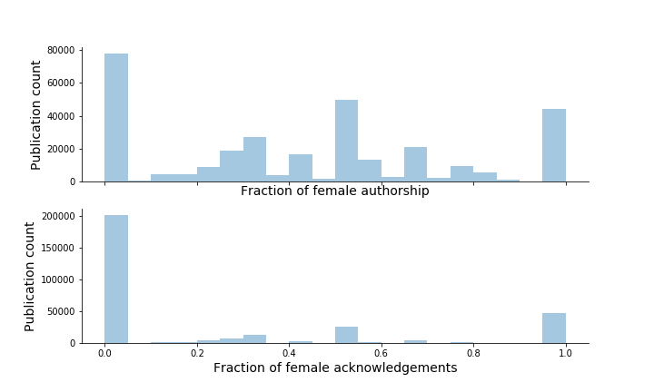

# Hidden Figures

## Project Overview
An investigation into the acknowledgments section of research articles within [PubMed Central](https://www.ncbi.nlm.nih.gov/pmc/).
Prior literature suggests there is a gender discrepancy between men and women in authorship and acknowledgment. 
Specifically, it has been observed that women were more likely to be acknowledged rather than the author list, in a small sample of  [theoretical population genetics publications](https://www.biorxiv.org/content/early/2018/07/05/360933). We tested this observation on a large-scale across biomedical research articles and investigated the contributions of acknowledged individuals.

## Hypotheses

1. Women are more likely to be on the acknowledgments than the author list would suggest.
2. The acknowledgment for the types of tasks for men and women differ.
3. The type of praise given men and women differ (_fruitful_ discussion, _outstanding_ analysis).
4. These trends change over time, reflecting more equality.


### Literature Review
Few large-scale studies have been conducted on acknowledgments in research articles; our study is novel in size and scope. Notable previous studies: 


[Khabsa et al., 2012](https://link.springer.com/chapter/10.1007/978-3-642-29047-3_43)
- extracted acknowledgments sections from articles in [CiteSeerX](http://citeseer.ist.psu.edu/index;jsessionid=75C159A83DB7C9F3624F934430F5F3E7)
- identified individuals and organizations
- build network graph of acknowledged entities and authors


[Paul-Hus et al., 2017](https://journals.plos.org/plosone/article?id=10.1371/journal.pone.0185578)
- extracted acknowledgements sections from articles in [Web of Science](https://clarivate.com/products/web-of-science/)
- identified acknowledged contributions
- analyzed trends in contributions by field of study

## Analysis of Features

### Data Sources and Extraction

Source: [PMC FTP](https://www.ncbi.nlm.nih.gov/pmc/tools/ftp/)

The PMC XML files have an `<ack>` tag for the Acknowledgments section.
For example, consider [PMC 4959138](https://www.ncbi.nlm.nih.gov/pmc/articles/PMC4959138/):

```
<ack>
    <p>
	We thank Alexia Prskawetz for the fruitful discussions and remarks. 
	Further on, we would like to thank the referees and editors for their 
	valuable comments. This research was partly supported by the Austrian 
	Science Fund (FWF) under Grant No. P25979-N25 and is an extract out of 
	the Ph.D. thesis (Moser <xref ref-type="bibr" rid="CR30">2014</xref>).
    </p> 
</ack>
```

### Sentence parsing using [spaCY](https://spacy.io/)


### PMC acknowledgments over time


## Natural Language Processing

### Extract names and infer gender using [genderize](https://genderize.io/)
Acknowledgments and, to a lesser extent, authorship is skewed toward men.



### Summary stats
For the PubMed Central subset with acknowledgments (PMCA): 
+ Number of pubs in PMCA with authors with identifiable genders: 312,237
+ Fraction of women in PMCA in the acknowledgments: 0.424 
+ Fraction of women on PMCA in the pubs: 0.233
+ Median number of people on an acknowledgments: 5
+ Most acknowledgments are uni-gender: 80%
+ Most of these uni-gender acknowledgments are all-male 202,150 vs 47,105


### Quality control

| Acknowledgment Name Parsing Error | Occurrence |PMCID | Example
|--|--|--|--
| Author's Name Listed  | 4.5% | [PMC3339585](https://www.ncbi.nlm.nih.gov/pmc/articles/PMC3339585/) | **Smriti Shrivastava** is thankful to CSIR for Senior Research Fellowship
| Fellowship Name|2.0%|[PMC5864053](https://www.ncbi.nlm.nih.gov/pmc/articles/PMC5864053/)|J.S. was funded by a Biotechnology and Biological Sciences Research Council (BBSRC) **David Phillips Fellowship** (BB/L024551/1)
|Organization Name |2.0%|[PMC4160263](https://www.ncbi.nlm.nih.gov/pmc/articles/PMC4160263/)|National Institute of Biomedical Imaging and Bioengineering Grant R01 EB006745 **Stanford Bio-X**, the American Heart Association (Western States Affiliates)
| Award Name | 1.5% |[PMC4189622](https://www.ncbi.nlm.nih.gov/pmc/articles/PMC4189622/)|**Seed Grant** provided by Michigan Technological University (MTU)
| Disclosure | 1.5% |[PMC4147052](https://www.ncbi.nlm.nih.gov/pmc/articles/PMC4147052/)|In addition, **Jin Jin** also holds stock in Eli Lilly
| Dedication | 0.5% |[PMC4831668](https://www.ncbi.nlm.nih.gov/pmc/articles/PMC4831668/)|This paper is dedicated to **José Luis García Ruano** on occasion of his retirement


### Extract [MeSH terms](https://www.ncbi.nlm.nih.gov/mesh) and analyze based on presence of acknowledgment
MeSH terms from PMC articles **without** acknowledgments tend to be clincally-focused.


MeSH terms from PMC articles **with** acknowledgments tend to focus on fundamental research.


### Extract nouns and verbs associated with acknowledged individuals
Words associated with acknowledged individuals, colored by gender: purple words are predominantly associated with men and green words are predominantly associate with women; grey is used for words that are equally associated with both genders. Larger words appear more frequently. Gender-specific words were preferentially selected.

**Nouns**


**Verbs**


We manually curated a list of [keywords](keywords_extraction/candidate_keywords.txt) to group acknowledgements into six categories based on the type of contribution being acknowledged: Manuscript, Coordination, Materials, Analysis, Procedures, Advice. For each category, we calculated the representation of female names.

| Category | Percent of female names|
|--|--|
|manuscript| 52.1%|
|coordination|50.0%|
|procedure| 44.7%|
|analysis| 41.4% |
|material| 37.8% |
|advice| 32.6%|

### [Whimsy in acknowledgments](fun_quotes.md)

### Contributors

+ [Travis Hoppe](https://github.com/thoppe)
+ [Rebecca Meseroll](https://github.com/rmeseroll)
+ [Hao Yu](https://github.com/summer66)
+ [Abbey Zuehlke](https://github.com/zuehlkead)
+ [Grant Jones](https://github.com/grantdjones)
+ [Brad Busse](https://github.com/facepalm)

### Project pipeline
- Literature review
  - Historical acknowledgments research
  - Gender in authorship/acknowledgments
- Analysis of features
  - Extract acknowledgments from PMC
  - Analyze acknowledgment features
    - % PMC coverage, years, journals, MeSH terms, etc.
    - False negatives?
- Natural Language Processing (NLP)
  - Names → infer gender with genderize.io
  - Organizations and objects
  - Acknowledged tasks
  - Task modifiers (**stretch goal**)


