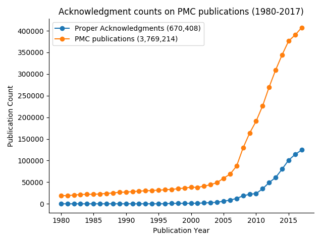
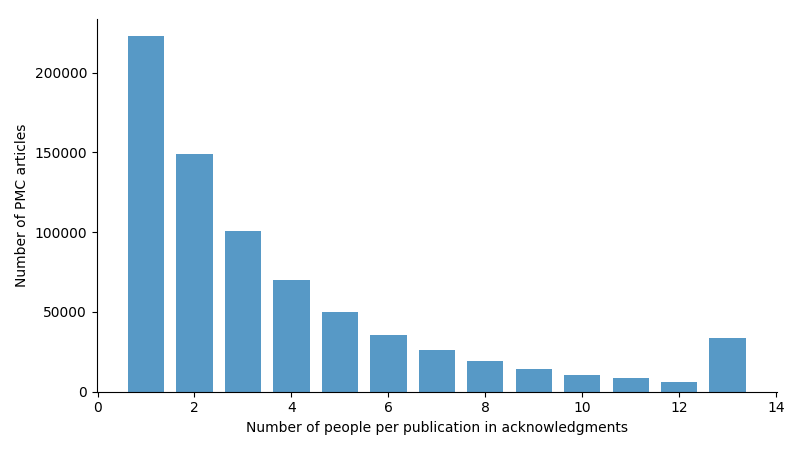

Access dates:

```
-rw-rw-r-- 1 hoppeta hoppeta  5817271380 Sep  6 11:39 articles.A-B.xml.tar.gz
-rw-rw-r-- 1 hoppeta hoppeta  6843338714 Sep  6 11:27 articles.C-H.xml.tar.gz
-rw-rw-r-- 1 hoppeta hoppeta  8789517680 Sep  6 11:33 articles.I-N.xml.tar.gz
-rw-rw-r-- 1 hoppeta hoppeta 11068643003 Sep  6 11:36 articles.O-Z.xml.tar.gz
```

File Hashes:

```
md5sum *.gz
333b8d420a924dbce6f8f47db408fc3b  articles.A-B.xml.tar.gz
b30f87a8b28246f05678a1d0d5324a8c  articles.C-H.xml.tar.gz
c8c421d596bbd2685ccece074f76ba9a  articles.I-N.xml.tar.gz
0fc411c9f4789dff3fb31b8ec4c61f2f  articles.O-Z.xml.tar.gz
```

From 1980-2017
+ Total PMC articles: 3,769,214
+ Pubs with proper acknowledgements (at least one name and doesn't match author list): 670,408

# Parsed results, per publication

```
         n_sentences       n_people
count  747525.000000  747525.000000
mean        1.742841       4.285726
std         2.014077       9.891483
min         1.000000       1.000000
25%         1.000000       1.000000
50%         1.000000       3.000000
75%         2.000000       5.000000
max       375.000000    2424.000000
```

# Examples of very high people counts

```
PLoS_Med/PMC4380415.nxml	228	2424
PLoS_One/PMC4411156.nxml	50	2197
Surg_Endosc/PMC6061087.nxml	139	1435
PLoS_One/PMC4605674.nxml	51	1111
Crit_Care/PMC6097245.nxml	319	1009
Crit_Care/PMC5998562.nxml	275	996
```

Sources of error identified in the Hackathon that have been corrected in later versions:

+ Removing names that appear in the author lists
+ Stemming/lemmatizing words
+ Removing more sections like funding/disclosure/etc


## Update figures

Data can be found in [results](results)






